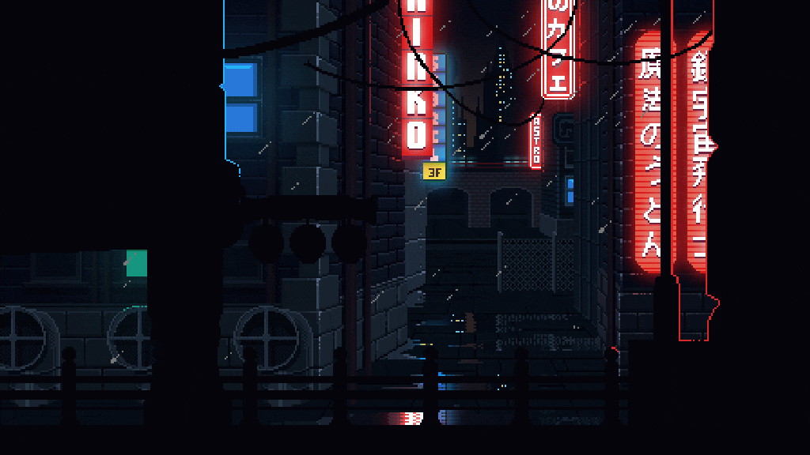

<h1 align="center"> 
  :heartpulse: Welcome to my GitHub :heartpulse:
    
  
   
  
</h1>

## :information_source: About Me :
I'm a beginner _**Full Stack Developer**_ from Belarus.
  - :telescope: I’m a Software Engineer and contributing to _frontend_ and _backend_ for building web applications.
  - :book: I'm currently progressing in various technologies as well as in English.
  - :mortar_board: I'm a **fourth-year student** and study at PSU.
  - :mag_right: I'm actively looking for a job.
  - :zap: Fun fact: I enjoy learning new technologies and exploring tech. When I do this, I like to chew something.

## :fire: Stats :
<table>
  <a href="https://github.com/exxusio/">
  
  
  
</table>

## :globe_with_meridians: Languages :

  
  
  
  
  
  
  

## :hammer_and_wrench: Technologies And Tools :

  
  
  
  
  

### Including :
- **Architectures:**
    - _N-layer_
    - _Clean_
    - _Microservices_
- **Entity Framework**
- **FluentAssertions**
- **FluentValidation**
- **AutoMapper**
- **Unit Tests**
- **Identity**
- **Blazor**
- **LinQ**

<i><h3 align="right"> :envelope: Connect with me :</h3></i>

  
  
  

